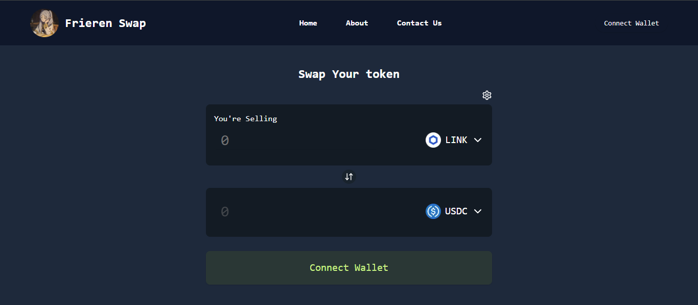

# Frieren Swap



## Description

This project, **Frieren Swap**, is a Swap Token in ethereum chain. my purpose create this website for learning how swap token work. The website is built using Next.JS, wagmi, and moralis.

## Live Website

You can access the live version of the website here: [Live URL](https://frieren-swap.vercel.app/)

## Getting Started

Follow these instructions to set up and run the project on your local machine for development and testing purposes.

### Prerequisites

Make sure you have the following installed on your local machine:

- [Node.js](https://nodejs.org/en/) ( version ^20.11.1 or below)
- [npm](https://www.npmjs.com/get-npm) (version ^10.5.2)

### Dependencies

This project uses the following main libraries and frameworks:

- [Next.js](https://nextjs.org/) - React Framework for production
- [Tailwind CSS](https://tailwindcss.com/) - Utility-first CSS framework
- [WAGMI](https://wagmi.sh/) - React Hooks for Ethereum
- [Moralis](https://docs.moralis.com/) - Moralis used for connecting to blockchain APIs
- [1inch](https://portal.1inch.dev/documentation) - DEX Aggregator for best token swap price

### Installation

Follow these steps to get the project running locally:

noted : you need api moralis and 1inch if you want test this project.

1. **Clone the repository:**
   ```bash
   git clone https://github.com/isfndiar/Frieren-Swap.git
   ```
2. **Navigate to the project directory:**
   ```bash
   cd ./Frieren-Swap
   ```
3. **Install dependencies that required**
   ```bash
   npm install
   ```
4. **Set up your env**

   ```bash
   NEXT_PUBLIC_MORALIS_API_KEY=
   MORALIS_API_KEY=
   BACKEND_API_KEY=http://localhost:3000
   NEXT_PUBLIC_BACKEND_API_KEY=http://localhost:3000
   NEXT_PUBLIC_API_INCH=

   ```

5. **Running on development**

   ```bash
   npm run dev
   ```
